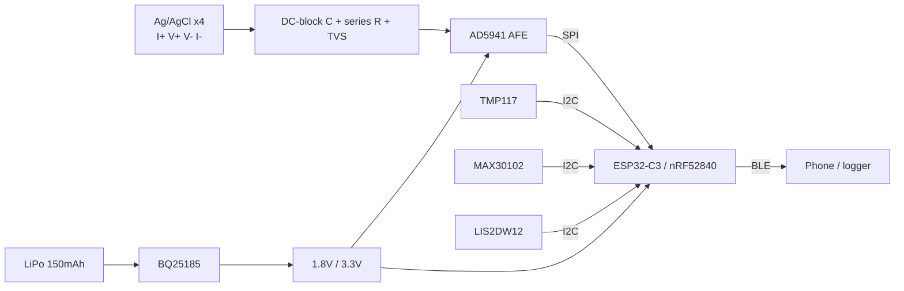

# Block diagram

```mermaid
flowchart LR
  E[Ag/AgCl x4<br/>I+ V+ V- I-] --> P[DC-block C + series R + TVS]
  P --> AFE[AD5941 AFE]
  AFE -- SPI --> MCU[ESP32-C3 / nRF52840]
  T[TMP117] -- I2C --> MCU
  PPG[MAX30102] -- I2C --> MCU
  ACC[LIS2DW12] -- I2C --> MCU
  BAT[LiPo 150mAh] --> CHG[BQ25185] --> LDO[1.8V / 3.3V] --> MCU
  LDO --> AFE
  MCU -- BLE --> PH[Phone / logger]
```
